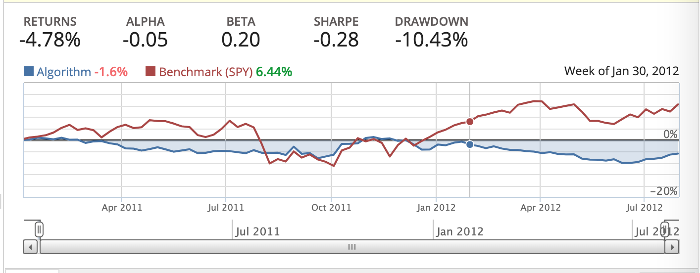
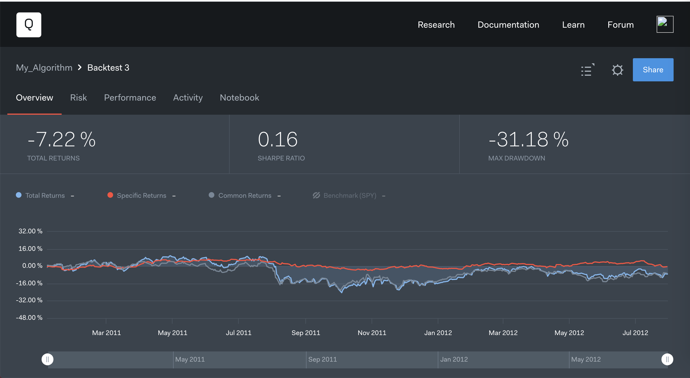

# Quantopian教程源码解析及实战

​	本文主要侧重于采用Quantopian进行实际的金融策略分析，因此阅读本文前，需要对Quantopian的有基本的了解，建议先阅读Quantopian的tutorial部分。值得注意的是，Quantopian提供了两种实验环境，一种是类似Jupyter的Notebook，需要注意这种环境下是不能顺利运行源码的，会显示缺少Quantopian.algorithm模块。另外一种环境是algorithm环境，该环境下提供了基本的框架，同时有完备的环境，我们选择后者进行编程。

## tutorial源码分析

​	首先本文还是对原Quantopian最后一节的源码进行简单的分析，这有助于后续采用这种操作进行股票买卖。

​	首先介绍的是初始化部分。该部分主要定义一些接下来使用的全局变量，包括策略优化的周期，以及对应构建的pipeline信息等。同时因为pipeline是全局都在访问的，因此其采用一个 attach_pipeline() 绑定的方式来减少传参。

``````python
def initialize(context):
    """
    Called once at the start of the algorithm.
    """
    #周期函数,用于指定对应的调整方法多久执行一次
    #这里设定对应的周期是每周开盘的时候执行一次。
    algo.schedule_function(
        rebalance,
        date_rules.week_start(),
        time_rules.market_open()
    )

    #创建对应的数据流水线。
    my_pipe = make_pipeline()
    #用于注册对应的流水线。从而避免采用变量不断的传输
    attach_pipeline(my_pipe, 'my_pipeline')
``````

​	紧接着是对make_line模块进行的分析，这一块也是tutorial中分析最多的地方。因此咱们简单分析一下即可。该部分主要包含对于pipeline数据的一个处理。首先是选定了基础基准来加速后面factor的一个生成。然后数据方面主要是考虑一个30天均线和10天均线的一个差异变化，并且同时记录每天的两种均线差异最大的和两种均线差异最小的75个股票，来作为整个模型的数据集。

``````python
def make_pipeline():
    """用于构建数据Dataframe格式"""
    #base_universe用于筛选一个数据集中符合某些规则的股票，
    #这里采用默认的QTradableStocksUS准则。
    base_universe = QTradableStocksUS()
    
    # 构造对应股票10天的简单均线，采用mask对数据进行过滤。
    mean_10 = SimpleMovingAverage(
        inputs=[USEquityPricing.close],
        window_length=10,
        mask=base_universe
    )
    #原理同上。
    mean_30 = SimpleMovingAverage(
        inputs=[USEquityPricing.close],
        window_length=30,
        mask=base_universe
    )
    percent_difference = (mean_10 - mean_30) / mean_30

    # 采用filter 选取75个均线差异最大的股票。
    # 采用filter，选取75个均线差异最小的股票。
    shorts = percent_difference.top(75)
    longs = percent_difference.bottom(75)

    # 混合的filter，用于后续返回数据dataframe时采用screen进行筛选。
    securities_to_trade = (shorts | longs)
    
    #这里选择返回只有对应shorts和longs数据一个dataframe即可。
    return Pipeline(
        columns={
            "shorts":shorts,
            "longs":longs,
        },
        screen = (securities_to_trade),
    )
``````

​	再来看看before_trading_start()函数的部分，这部分主要在每天开盘前调用，目的是为了收集符合前述long和short条件的股票。并保存到字典变量context中作为变量使用。

``````python
def before_trading_start(context, data):
    """开市前获取pipeline每天的输出。主要是对context的内容进行修改。 """   
    pipe_results = pipeline_output('my_pipeline')

    #统计所有符合long和short条件的股票。
    #保存到context的某个类变量中。
    context.longs = []
    for sec in pipe_results[pipe_results['longs']].index.tolist():
        if data.can_trade(sec):
            context.longs.append(sec)

    context.shorts = []
    for sec in pipe_results[pipe_results['shorts']].index.tolist():
        if data.can_trade(sec):
            context.shorts.append(sec)
``````

​	至于compute_target_weights(context,data)部分，这里的weights是一个矩阵，里面保存的是对不同的股票分散投资的比例。那么自然而然的，rebalance()模块部分，自然是对这个weights进行优化的过程。只要优化权重比值合适，就可以得到最赚钱的投资策略。

``````python
def compute_target_weights(context, data):
    """用于计算对应股票应该分配的权重矩阵"""

    weights = {}
    # 鲁棒性检测，若无longs和short其中一个，则当前数据不完备并返回。
    if context.longs and context.shorts:
        long_weight = 0.5 / len(context.longs)
        short_weight = -0.5 / len(context.shorts)
    else:
        return weights

    # 给每个对应的股票分配权重。
    for security in context.portfolio.positions:
        if security not in context.longs and security not in context.shorts and data.can_trade(security):
            weights[security] = 0

    for security in context.longs:
        weights[security] = long_weight

    for security in context.shorts:
        weights[security] = short_weight

    return weights
            
def rebalance(context, data):
    """按照schedule_function()的频率调整对应的买卖策略。"""
    # 计算矩阵权重。
    target_weights = compute_target_weights(context, data)

    # 采用优化器优化权重。
    if target_weights:
        order_optimal_portfolio(
            objective=opt.TargetWeights(target_weights),
            constraints=[],
        )
``````

运行代码最后得到的测试结果，可以看到上方的指标是对设计的算法的一些结果反馈，return指的是我们回报的收益，蓝色代表算法的投资回报率，红色代表标普500指数（SPY）的投资回报率。可以说案例的代码其实还是不太ok。



​	然后其实总体的看下来源码，Quantopian更多的是提供一个框架，很多底层的实现对于使用的人来说都是透明的，包括许多函数的参数Context和data等，没有办法了解到其最完整的运行结构，对于更深入的去了解整个模型的架构是比较有困难的。但这样也有一个优点就是，可以简化整个模型的架构，方便更多小白们入手学习这一个框架。

## Quantopian策略实战

沿着上述的大致的框架以及参考[博客](https://wxd.dachuiblog.xyz/?p=107)的内容，我们现在来设计自己的一个交易策略。首先设计的自然是initialize(context)模块。这里我们参照原本的框架，为了保证时效性，我们设置为每天更新一次股票投资策略。

``````python
def initialize(context):
    #设定每天开盘时执行一次。
    algo.schedule_function(
        rebalance,
        date_rules.every_day(),
        time_rules.market_open()
    )
    #用于注册对应的流水线。从而避免采用变量不断的传输
    attach_pipeline(
        make_pipeline(), 
        'my_pipeline'
    )

``````

接下来修改make_pipeline()部分来设计自己的对数据的一个提取策略，由于通常的简单均值，对于股票的表示有滞后性，因此我们采用时效性更强的指数均值。如果想深入了解这些指标的差异，可以查看[文章](https://zhuanlan.zhihu.com/p/38276041)。整体的股票筛选的策略可以描述如下：

1. 过去200天的日均交易额前1500名。

2. 指数均线变化大于0。
3. 指数均线变幻的前50名。

``````python
def make_pipeline():
    #base_universe为选择过去200天的日均成交金额排名的前1500名
    base_universe = Q1500US()
    
    #20天/200天的指数均线
    EWMA_20 = ExponentialWeightedMovingAverage(
        inputs=[USEquityPricing.close],
        window_length=20,
        mask=base_universe,
      	decay_rate = 0.5,
    )
    EWMA_200 = ExponentialWeightedMovingAverage(
        inputs=[USEquityPricing.close],
        window_length=200,
        mask=base_universe,
      	decay_rate = 0.5,
    )
    
    percent_diff = (EWMA_20 - EWMA_200) / EWMA_200
    
    #screen部分用均线变化的前50名，且需要均线变化大于0.
    return Pipeline(
        columns ={
        'EWMA_20':EWMA_20,
        'EWMA_200':EWMA_200,
        },
        screen = base_universe & percent_diff.top(50) & (percent_diff>0),
    )
``````

​	在before_trading_start(context,data)，也需要重新稍微调整一下。

``````python
def before_trading_start(context, data):
    pipe_results = pipeline_output('my_pipeline')

    context.sec = []
    for sec in pipe_results.index.tolist():
        if data.can_trade(sec):
            context.sec.append(sec)
``````

​	然后需要修改的还有compute_target_weights(context,data)部分，这里我们依旧采用源码中对多个股票采用投资的策略的方式，只不过我们采用的方式更为的粗暴，直接对我们上述在pipeline中选中的符合条件的股票均摊份额。而没有被选中的则不投资。源码如下：

``````python
def compute_target_weights(context, data):
    """用于计算对应股票的投资组合。"""
    weights = {}
    if context.sec:
        sec_weight = 1.0/len(context.sec)
    else:
        return weights

    # 给每个对应的股票分配权重。
    for security in context.portfolio.positions:
        if security not in context.sec and data.can_trade(security):
            weights[security] = 0

    #均摊份额。
    for security in context.sec:
        weights[security] = sec_weight

    return weights
``````

至于别的部分如rebalance部分，则不需要改动，维持原状即可。随后便可以开始进行回测，最后得到的结果如下图：



​	这里我们运行了完整的一个回测，可以看到这个策略的算法给我们带来的收益并不高，一方面是根据图线可以看到，波动幅度很大，这也是由于指数均线带来的一个缺点，因此我们的策略更换频繁，就很难赚到钱。后续可以对进一步优化我们的策略，从而实现全自动化炒股赚钱来赢取尽可能多的收益。

## 总结

​	可以看到我们参照了基本的源码来详细的分析，同时更深层次的，我们依照自己的理解更换了源码中的一些参数和内容，并且进行了回测，尽管效果并不显著，但是算是一种新的尝试吧。更多的还是了解到量化交易的强大和能力，未来也期待有机会可以进行真正的交易，实现自己的资本主义梦想。

## 参考文献

[量化交易平台Quantopian学习的笔记（一）](https://blog.csdn.net/wangweixing2000/article/details/89297130?ops_request_misc=%7B%22request%5Fid%22%3A%22159274507719195265927480%22%2C%22scm%22%3A%2220140713.130102334..%22%7D&request_id=159274507719195265927480&biz_id=0&utm_medium=distribute.pc_search_result.none-task-blog-2~all~first_rank_ecpm_v3~pc_rank_v3-4-89297130.first_rank_ecpm_v3_pc_rank_v3&utm_term=quantopian)

[如何构建投资组合](https://wxd.dachuiblog.xyz/?p=107)

[趋势跟踪：均线及其Quantopian实现](https://wxd.dachuiblog.xyz/?p=56)

[Quantopian官网教程](https://www.quantopian.com/tutorials/pipeline)

[移动平均：你知道的与你不知道的](https://zhuanlan.zhihu.com/p/38276041)

